## Part 1. Готовый докер

##### Возьмем официальный докер-образ с **nginx** и выкатим его при помощи команды `docker pull`.
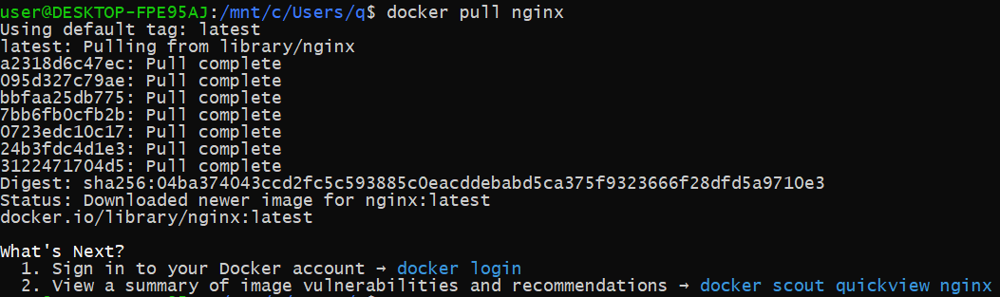

##### Проверим наличие докер-образа, запустив команды `docker images`.
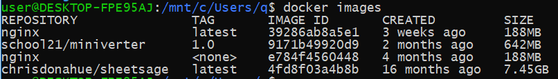

##### Запустим докер-образ через `docker run -d [images_id|repository]`.
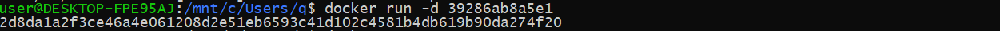

##### Проверим, что образ запустился через `docker ps`.
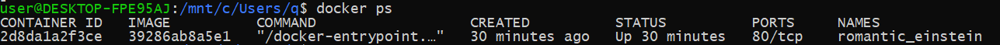

##### Посмотрим информацию о контейнере через `docker inspect [container_id|container_name]`.
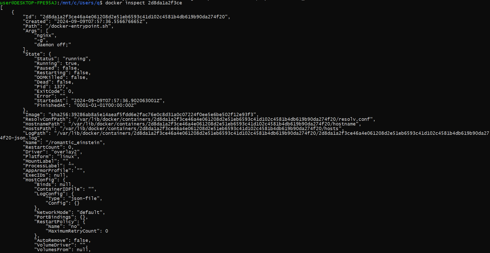
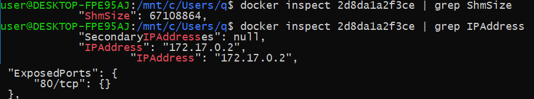

##### Остановим докер образ через `docker stop [container_id|container_name]` и проверим, что образ остановился с помощью команды `docker ps`.
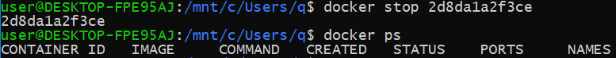

##### Запустим докер с портами 80 и 443 в контейнере, замапленными на такие же порты на локальной машине, через команду *run*.
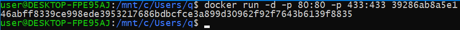

##### Проверим, что в браузере по адресу *localhost:80* доступна стартовая страница **nginx**, просто перейдя по ссылке.
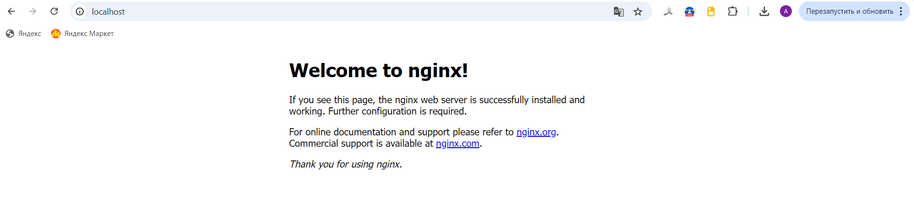

##### Перезапустим докер контейнер через `docker restart [container_id|container_name]` и проверим, что запустился
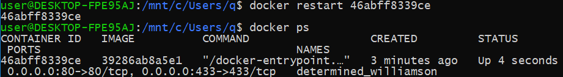

## Part 2. Операции с контейнером

##### Прочитаем конфигурационный файл *nginx.conf* внутри докер контейнера через команду *exec*.
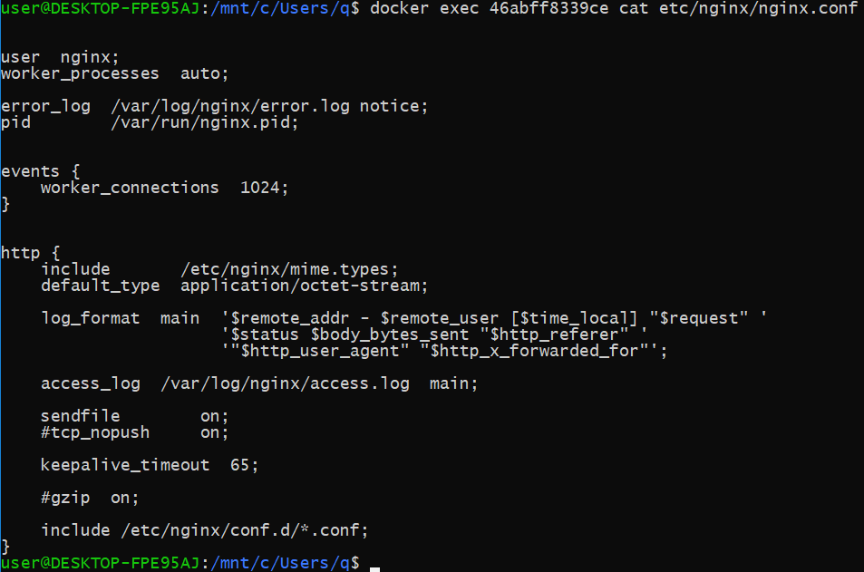

##### Создадим на локальной машине файл *nginx.conf* и настроем в нем по пути */status* отдачу страницы статуса сервера **nginx**.
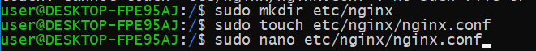
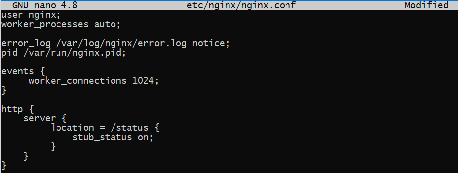

##### Скопируем созданный файл *nginx.conf* внутрь докер-образа через команду `docker cp` и перезапустим.
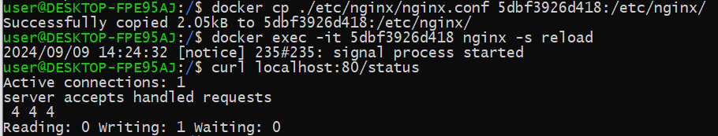

##### Экспортируем контейнер в файл *container.tar* через команду *export* и остановим.

##### Удалим образ через `docker rmi [image_id|repository]`, не удаляя перед этим контейнеры.
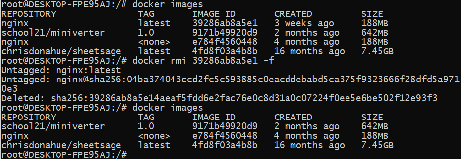

##### Удалим остановленный контейнер.
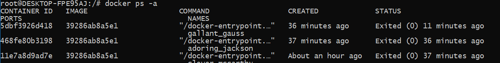
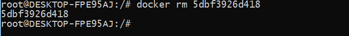

##### Импортируем контейнер обратно через команду *import*, запустим и проверим работу.
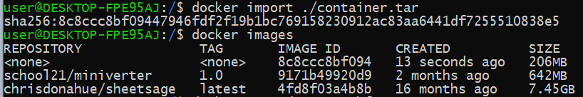
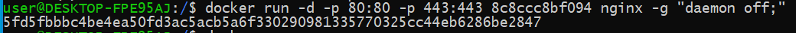
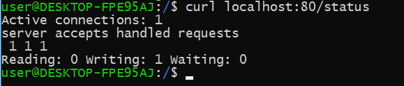